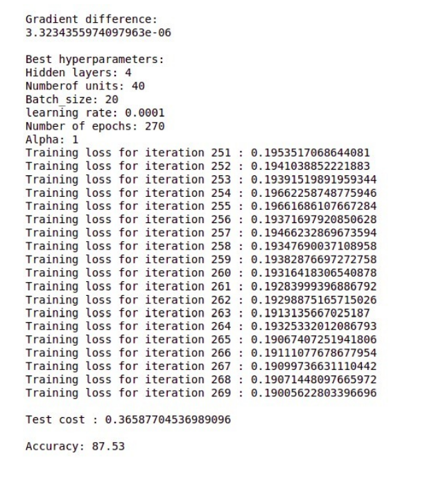
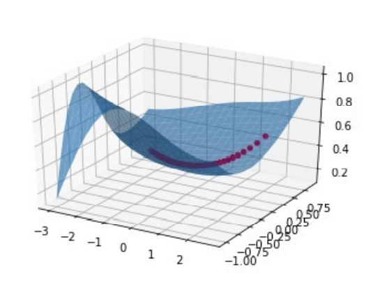

# Image classification using a Deep Neural Network developed from scratch

A multi-layer Neural Netwrok was trained t classify fashion items from Fashion MNIST dataset. Forward and backward propogation algorithms were developed from scratch and GRID search was used for selecting the optimal hyperparameters.

Using the optimization hyperparameters, training loss for the last 20 epochs can be seen as follows. Also, a test accuracy of 87.53% was achieved using this network. 

 

The following graph shows the SGD trajectory while being trained on the netwrok. It shows the cross-entropy loss as a function of weights and biases.

 

